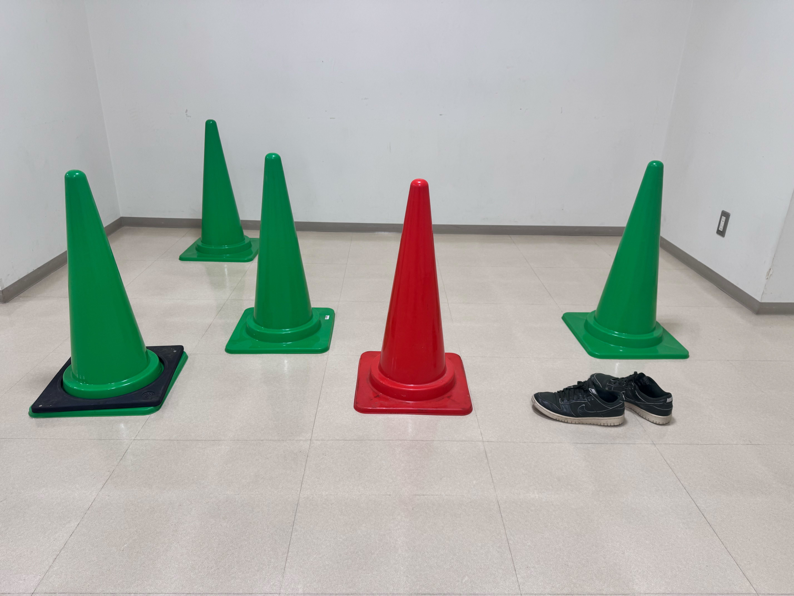

# テキストベースオブジェクト除去システム

自然言語で指定したオブジェクトを画像から除去するAIツール

## 結果例

<div align="center">

| 元画像 | 除去結果 |
|--------|----------|
|  |  |

プロンプト: `"red pylon"` → 赤いパイロンが自動的に除去され自然に修復

</div>

## インストール

```bash
# 1. サブモジュールの初期化
git submodule update --init --recursive

# 2. モデルファイルのダウンロード
chmod +x install/download_models.sh
./install/download_models.sh

# 3. 依存関係のインストール
pip install -r install/requirements.txt
pip install groundingdino-py
```

## 使い方

```bash
# 実行（config.yamlを使用）
python3 text_remove_anything.py
```

### 出力構造

処理結果は以下のディレクトリ構造で保存されます：

```
output_image/
├── GroundingDINO/    # 物体検出結果の可視化
│   ├── image1.jpg
│   └── image2.jpg
├── SAM/              # セグメンテーションマスク
│   ├── image1_mask0.jpg
│   └── image2_mask0.jpg
└── LAMA/             # 最終的な修復結果
    ├── image1.jpg
    └── image2.jpg
```

## 機能特徴

- **バッチ処理対応**: ディレクトリ内の全画像を自動処理
- **結果分離出力**: 検出・セグメンテーション・修復結果を別々に保存
- **メモリ最適化**: GPU/CPU自動切り替え、メモリ不足時の画像リサイズ
- **可視化**: GroundingDINOの検出結果を画像として保存

## システム構成

- **GroundingDINO**: テキストでオブジェクト検出
- **SAM**: 高精度セグメンテーション  
- **LaMa**: 自然な画像修復

## 設定 (config.yaml)

```yaml
# 処理パラメータ
processing:
  input_dir: "./input_image"       # 入力画像ディレクトリ
  output_dir: "./output_image"     # 出力ベースディレクトリ
  box_threshold: 0.35              # 物体検出の信頼度
  dilate_kernel_size: 20           # マスク拡張サイズ
  max_image_size: 2048             # メモリ節約の画像リサイズ上限
  batch_processing: true           # バッチ処理を有効化
  save_intermediate: true          # 中間結果を保存

# デフォルト値
general:
  default_text_prompt: "red pylon"
  output_subdirs:
    grounding_dino: "GroundingDINO"
    sam: "SAM"
    lama: "LAMA"

device:
  type: "auto"                     # cuda/cpu/auto
```

## プロジェクト構造

```
├── text_remove_anything.py      # メインスクリプト（バッチ処理対応）
├── config.yaml                 # 設定ファイル
├── utils/                      # ユーティリティモジュール
│   ├── config_loader.py        # 設定管理
│   ├── text_grounding_detector.py  # GroundingDINO wrapper
│   └── sam_processor.py        # SAM wrapper
├── input_image/                # 入力画像ディレクトリ
├── output_image/               # 結果出力
│   ├── GroundingDINO/         # 検出結果可視化
│   ├── SAM/                   # セグメンテーションマスク
│   └── LAMA/                  # 最終修復結果
├── Inpaint-Anything/           # サブモジュール（SAM + LaMa）
└── doc/                        # ドキュメント・サンプル画像
```

## システム要件

- Python 3.8+
- CUDA対応GPU（推奨、CPUでも動作）
- 8GB以上のRAM

## 参考

- [GroundingDINO](https://github.com/IDEA-Research/GroundingDINO)
- [SAM](https://github.com/facebookresearch/segment-anything)  
- [LaMa](https://github.com/advimman/lama)